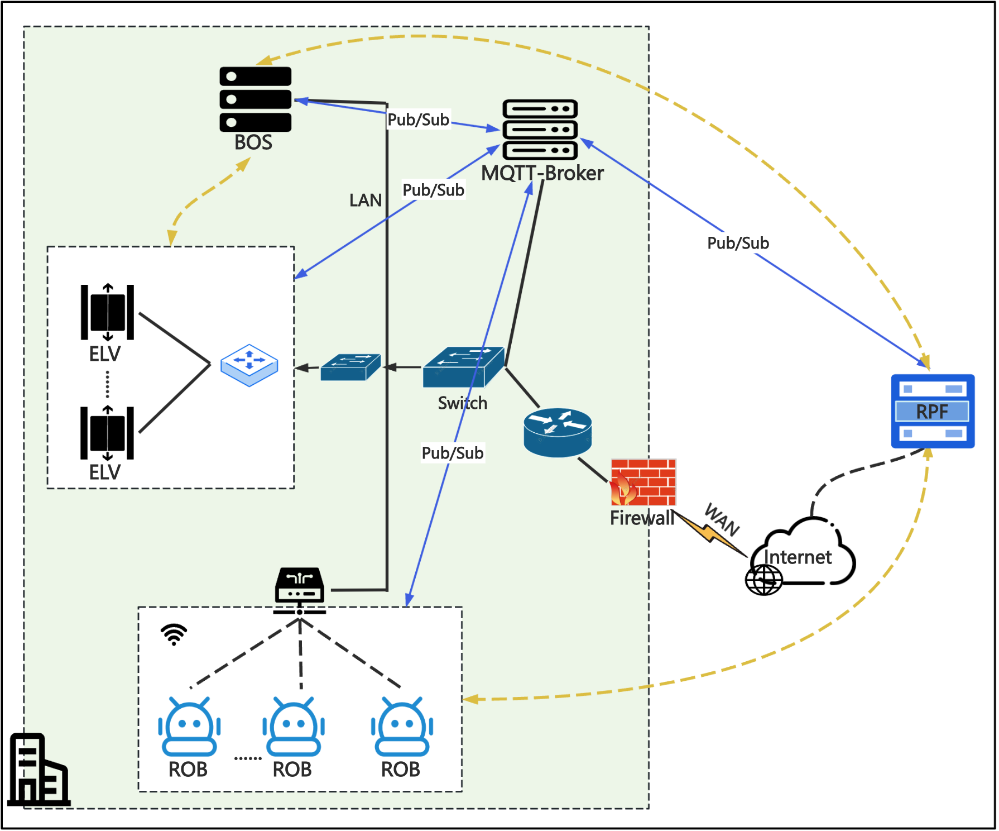
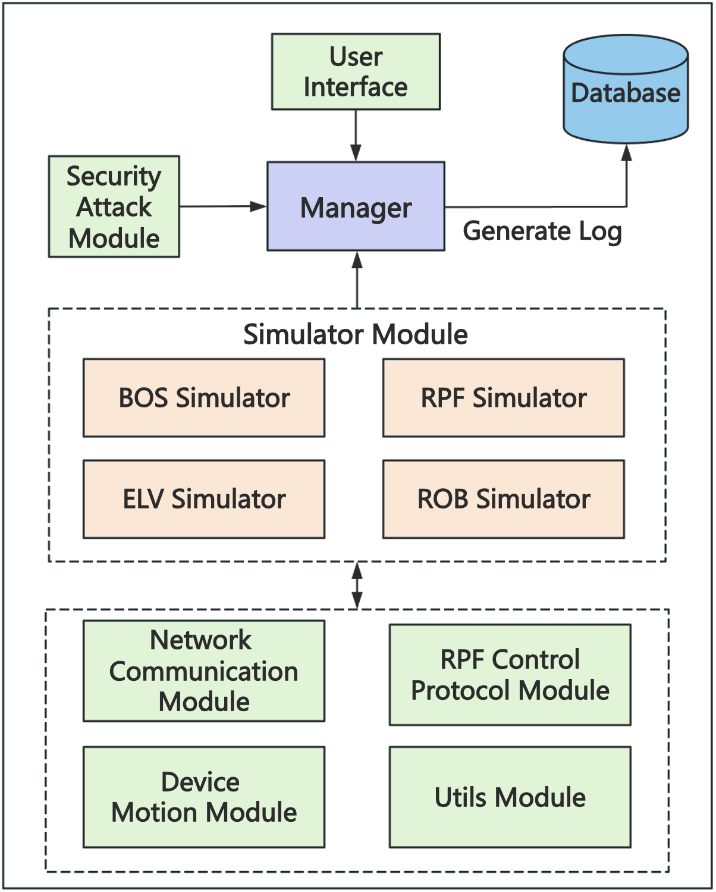
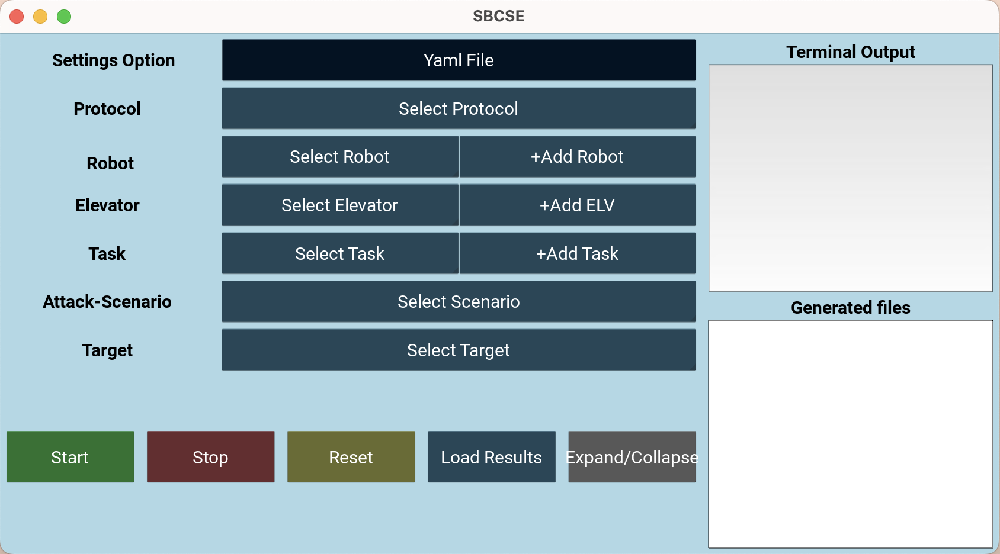

# SBCSE: Smart Building Control System Emulator

SBCSE is a smart building control system emulation platform that makes it possible to conduct security testing in connection with smart building control systems and communication protocols. The security testing capabilities of SBCSE include both evaluating the consequences of cyberattacks in the emulated smart building, and validating the implementation of appropriate security measures to counter those attacks. SBCSE is being developed by the [Cybersecurity Research Lab](https://www.jaist.ac.jp/is/labs/beuran-lab/) at Japan Advanced Institute of Science and Technology ([JAIST](https://www.jaist.ac.jp/english/)), Ishikawa, Japan.

_**NOTE:** SBCSE was created and is intended only for research activities. You should only use SBCSE in your own local network environment and at your own risk. SBCSE implements several offensive actions that may affect target hosts, and any other kind of use may lead to your legal liability. Consequently, SBCSE should always be used with due care in real network environments._

SBCSE was designed and implemented based on information and experiment log data regarding a actual smart building. The main components of the control system emulated in SBCSE are as follows:
* BOS: Building operating system that manages the smart building
* MQTT-Broker: Broker that facilitates the communication between the other components
* ELV and ROB: Elevators and autonomous robots in the smart building
* RPF: External robot platform for controlling the autonomous robots
<div align=center></div>

The architecture of SBCSE includes several modules, as shown in the figure below. The **Network Communication Module** is in charge of emulating the building control system communication based on the MQTT protocol. The **Device Motion Module** defines and configures the simulated motion of the autonomous robots and elevators, including robot navigation routes and elevator transitions between floors. The **Security Attack Module** makes it possible to use SBCSE for security testing by recreating different cyberattack scenarios within the emulator in order to quantify their effects and validate possible countermeasures.
<div align=center></div>

More details about the SBCSE implementation are available in the [implementation documentation](docs/implementation.md), and also in the references mentioned at the end of this file.


## Prerequisites

SBCSE is implemented in Python, and several libraries must be installed before using it, such as the `kivy` library for the user interface, and the PyYAML library for YAML files. Examples of the necessary commands for their installation are provided below:
```bash
pip install kivy
pip install pyyaml
```

In addition, an MQTT broker, such as Mosquitto, must be installed. For your reference, we provide detailed instructions for the case of macOS in the [MQTT setup documentation](docs/mqtt_setup.md).


## Quick Start

To run SBCSE, you can start the main program as shown below, and the scenario in the file `utils/scenario.yaml` will be executed:
```bash
python SBCSE.py
```

The scenario file can be modified as needed to change the settings. Alternatively, you can start the graphical user interface (GUI) of SBCSE, which makes it easy to change experiment settings, such as protocols, robots, elevators, attacks and targets. A screenshot of the user interface is shown below.
<div align=center></div>

To use the GUI, run the following command, make the desired settings, then press the **Start** button to begin scenario execution.
```bash
python -m interface.interface  
```

For more information about the security testing capabilities of SBCSE, refer to the [security testing documentation](docs/security_testing.md).

Note that we have also implemented additional functionality for validating the communication protocol implemented in SBCSE by using two methods: fuzz testing (aka, fuzzing), and formal verification. 
More details about these two methods are available in the [fuzzing documentation](docs/fuzzing.md) and [formal verification documentation](docs/formal_verification.md), respectively.


## References

For a research background about SBCSE, please consult the following paper and master's theses:
* X. Weng, R. Beuran, Smart building control system emulation platform for security testing, in: 2024 IEEE 29th Pacific Rim International Symposium on Dependable Computing (PRDC), 2024, pp. 220–223.
* X. Weng, [Smart Building Control System Emulation Platform for Security Testing](http://hdl.handle.net/10119/19784), Master’s thesis, Japan Advanced Institute of Science and Technology, 2025.
* J. Wu, [Formal and Experimental Verification of Robot Control Protocols for Smart Buildings](http://hdl.handle.net/10119/19793), Master’s thesis, Japan Advanced Institute of Science and Technology, 2025.
