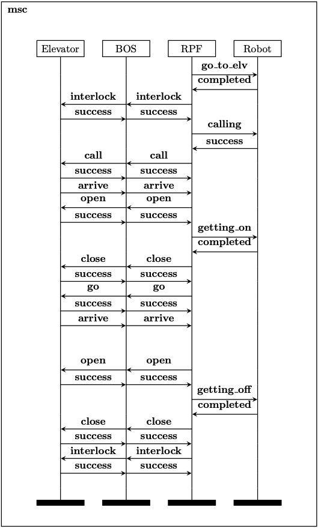

# Formal Verification

This file provides details on how to conduct the formal verification of the protocol specification for smart building control protocols, such as that implemented in SBCSE. In particular, the control protocol used in SBCSE involves four subsystems: Elevator, BOS (building OS), RPF (robot control platform) and Robot, as shown in the figure below. The pairs of control messages and their corresponding replies outline the logic of the control protocol.




## Prerequisites

The formal verification is conducted using the tool named Maude System which must be installed first according the the following [download and installation guide](https://maude.cs.illinois.edu/wiki/Maude_download_and_installation).


## Usage

Some basic instructions for using Maude are provided below.

### Start Maude

To start Maude, run the command below after entering the installation folder:
```
maude
```

The output will be similar to that shown below:
```
		     \||||||||||||||||||/
		   --- Welcome to Maude ---
		     /||||||||||||||||||\
	     Maude 3.4 built: Mar 16 2024 16:45:55
	     Copyright 1997-2024 SRI International
		   Sat Mar 15 16:40:06 2025
Maude>
```

### Load a file

To load a file, such as `single.maude`:
```
Maude> in single.maude
```

The output will be similar to that shown below:
```
==========================================
fmod STATUS
==========================================
fmod MOGSTATUS
==========================================
fmod PID
==========================================
fmod NZNAT
==========================================
fmod COMMAND
==========================================
fmod TOPIC
==========================================
fmod MESSAGE
==========================================
fmod NETWORK
==========================================
fmod TRAN
==========================================
fmod OCOM
==========================================
fmod CONFIG
==========================================
fmod INIT-CONFIG
==========================================
mod RCP
==========================================
.
Reading in file: "model-checker.maude"
==========================================
fmod LTL
==========================================
fmod LTL-SIMPLIFIER
==========================================
fmod SAT-SOLVER
==========================================
fmod SATISFACTION
==========================================
fmod MODEL-CHECKER
Done reading in file: "model-checker.maude"
==========================================
mod RCP-PROP
==========================================
mod RCP-FORMULA
```

### Conduct model checking

1. Using the `search` command as an example:
```
search ic =>* C:Config .
```

This command will show all the sequence of rewrites from the initial state to all the reachable states. The output will be similar to that shown below:
```
[...]
Solution 77 (state 76)
states: 77  rewrites: 87 in 4ms cpu (8ms real) (20265 rewrites/second)
C:Config --> ELV: elvq0 BOS: bosq RPF: r0e0 ROB: robq0 nw: void tran: init (
    msgCount[RPF]: 0) (movingStatus[ELV]: stay) movingStatus[ROB]: stay

No more solutions.
states: 77  rewrites: 88 in 4ms cpu (8ms real) (20360 rewrites/second)
```

We can then use the following command to see the sequence of rewrites numbered 76.
```
Maude> show path 76 .
```

2. Using the `modelCheck` command as an example:
```
Maude> red in RCP-FORMULA : modelCheck(ic,liveness) .
```

The output will be similar to that shown below:
```
reduce in RCP-FORMULA : modelCheck(ic, liveness) .
rewrites: 118 in 1ms cpu (1ms real) (103327 rewrites/second)
result Bool: true
```
Such an output means that the model meets the _liveness_ property.


## Command Description

| Commands      | Description                                                   | Replies                   |
|---------------|---------------------------------------------------------------|---------------------------|
| interlock1    | Command an elevator enter the corresponding specific status   | interlocksuccess1         |
| interlock2    | Command an elevator leave the corresponding specific status   | interlocksuccess2         |
| call          | Command an elevator to move to the target floor               | callsuccess, callarrive   |
| go            | Command an elevator to move to the target floor               | gosuccess, goarrive       |
| open          | Command an elevator door to open                              | opensuccess               |
| close         | Command an elevator door to close                             | closesuccess              |
| gotoelv       | Command a robot to go to the front of the elevator            | gotoelvcompleted          |
| gettingon     | Command a robot to get on the elevator                        | gettingoncompleted        |
| gettingoff    | Command a robot to get off the elevator                       | gettingoffcompleted       |
| schedulework  | Command a robot to work following it's schedule               | scheduleworkcompleted     |
| gotocharge    | Command a robot to charge                                     | gotochargecompleted       |
| calling       | Setting a robot to calling status                             | callingsuccess            |


## File Description

|  File Name                                                   |  Description                          |
|--------------------------------------------------------------|---------------------------------------|
| [single.maude](../formal_verification/example/single.maude)                   | basic version of single robot control |
| [multi.maude](../formal_verification/example/multi.maude)                     | multi robots control                  |
| [singleRPFVLD.maude](../formal_verification/example/singleRPFVLD.maude)       | model problem 2                       |
| [singleROBVLD.maude](../formal_verification/example/singleROBVLD.maude)       | model problem 3                       |
| [singleDoorVLD.maude](../formal_verification/example/singleDoorVLD.maude)     | model problem 4                       |
| [singlecmd.maude](../formal_verification/example/singlecmd.maude)             | model problem 5                       |
| [singlevariables.maude](../formal_verification/example/singlevariables.maude) | model problem 6                       |

**NOTE**: All the commands that have been used for the formal verification done with respect to a given file are included at the end of that file.


## Observable Components

| Component                             | Description                                                                       |
|---------------------------------------|-----------------------------------------------------------------------------------|
| (ELV: *s*)                            | the state of the elevator                                                         |
| (movingStatus[ELV]: *ms* )            | the moving status of the elevator                                                 |
| (BOS: *s*)                            | the state of the building OS                                                      |
| (RPF: *s*)                            | the state of the robot control subsystem                                          |
| (msgCount[RPF]: *n*)                  | the number of messages sent by the robot control subsystem in the current state   |
| (ROB: *s*)                            | the state of the robot                                                            |
| (movingStatus[ROB]: *ms*)             | the moving status of a robot                                                      |
| (nw: *msg*)                           | messages in the network                                                           |
| (tran: $t$)                           | the state transition taken most recently                                          |
| (ROB[*i*]: *s*)                       | the state of i-th robot                                                           |
| (RPF[*i*]: *s*)                       | the state the robot control subsystem (about the i-th robot)                      |
| (interlock: *bool*)                   | the interlock status of the elevator.                                             |
| (queue: *robid*)                      | a waiting queue of robots.                                                        |
| (floor[ELV]: *bool*)                  | whether the elevator arrives the correct floor                                    |
| (floor[ROB]: *bool*)                  | whether the robot arrives the correct floor                                       |
| (door: *open*)                        | whether the door open or close                                                    |
| (RPF[GOTOELVSUCCESS]: *bool*)         | the variable *R.GO_TO_ELV_SUCCESSGO_TO_ELV_SUCCESS*                               |
| (RPF[GOTOELVCOMPLETED]: *bool*)       | the variable *R.GO_TO_ELV_COMPLETED*                                              |
| (RPF[CALLINGSUCCESS]: *bool*)         | the variable *R.CALL_SUCCESS*                                                     |
| (RPF[GETTINGONSUCCESS]: *bool*)       | the variable *R.GETTING_ON_SUCCESS*                                               |
| (RPF[GETTINGONCOMPLETED]: *bool*)     | the variable *R.GETTING_ON_COMPLETED*                                             |
| (RPF[GETTINGOFFSUCCESS]: *bool*)      | the variable *R.GETTING_OFF_SUCCESS*                                              |
| (RPF[GETTINGOFFCOMPLETED]: *bool*)    | the variable *R.GETTING_OFF_COMPLETED*                                            |
| (RPF[INTERLOCKTRUESUCCESS]: *bool*)   | the variable *ELV.INTERLOCK_TRUE_SUCCESS*                                         |
| (RPF[INTERLOCKFALSESUCCESS]: *bool*)  | the variable *ELV.INTERLOCK_FALSE_SUCCESS*                                        |
| (RPF[OPENSUCCESS]: *bool*)            | the variable *ELV.OPEN_SUCCESS*                                                   |
| (RPF[CLOSESUCCESS]: *bool*)           | the variable *ELV.CLOSE_SUCCESS*                                                  |
| (RPF[CALLACCEPT]: *bool*)             | the variable *ELV.CALL_ACCEPT*                                                    |
| (RPF[CALLARRIVE]: *bool*)             | the variable *ELV.CALL_ARRIVE*                                                    |
| (RPF[GOACCEPT]: *bool*)               | the variable *ELV.GO_ACCEPT*                                                      |
| (RPF[GOARRIVE]: *bool*)               | the variable *ELV.GO_ARRIVE*                                                      |
