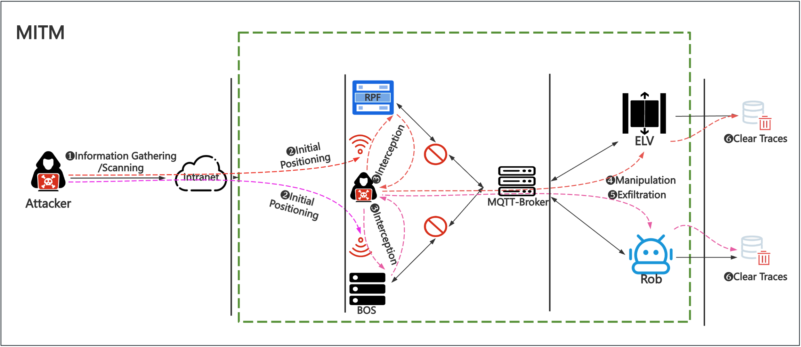
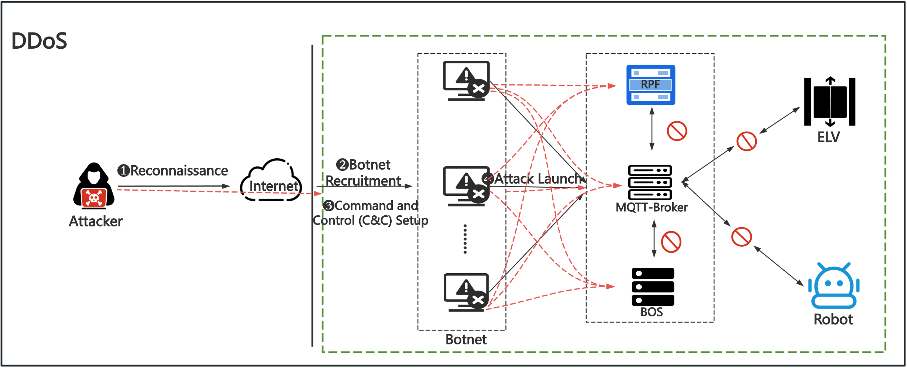
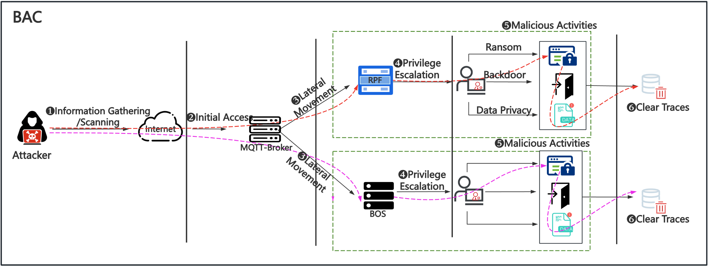

# Security Testing

This file provides details about the security testing features of SBCSE, in particular regarding cyberattacks and countermeasures. 

The attack scenarios that are currently implemented in the Security Attack Module are as follows:
* MITM: Man-in-the-Middle attack
* DDoS: Distributed Denial-of-Service attack
* BAC: Broken Access Control attack

In addition, we have designed malware-based attacks and social engineering attacks. However, these scenarios are closely related to user participation and personnel management, and SBCSE currently lacks a human simulation module. Therefore, their testing is not possible at this time, unless specific assumptions about user actions are made.

We note that in order to extend the security testing functionality of SBCSE, additional attack implementations can be added to the directory `security_attack_module/`. Then, support for that implementation should be included in the scenario switcher file `security_attack_module/scene_switcher.py`.

##  Scenario Settings Overview

When using SBCSE, you can choose the attack mode and target in two ways: through the GUI interface, or by configuring the `utils/scenario.yaml` file. Below is an example of how to configure the attack mode and target in the scenario file:
```
attack_scenario:
  - scenario_name: None
   # Options for attack mode
   # None => No attack
   # MITM => MITM attack
   # BAC => BAC attack
   # DDOS => DDoS attack
    target: None
    # Options for attack target
    # None => No target
    # For MITM or BAC attacks: BOS/RPF => Target BOS/RPF component
    # For DDoS attacks: C/P => Conduct connection/publish message flooding
```

When both `scenario_name` and `target` are set to `None`, the system operates in normal mode and no attack is conducted. If `scenario_name` is set to `MITM` or `BAC`, then the target must be specified, and it can be either `BOS` or `RPF`. If `scenario_name` is set to `DDOS`, then the target can be either `C` (connection flooding) or `P` (publish message flooding).

Next we will describe how to conduct experiments with each of the attack scenarios via some simple examples; please refer to the background papers mentioned in the README file for details.


## MITM Attack Scenario

MITM attacks take place as shown in the figure below. The system components that are susceptible to eavesdropping by attackers are BOS and RPF.



### Attack Settings

To use the MITM attack implementation in SBCSE, the scenario name and target must be configured in the `utils/scenario.yaml` file as indicated below:
```
attack_scenario:
  - scenario_name: MITM
    target: BOS or RPF
```

### Countermeasures

As for countermeasures, we integrated the **MQTTS** protocol in SBCSE, which is a secure communication protocol that combines the MQTT protocol with TLS encryption technology. When MQTTS is used, all transmitted data is protected by TLS encryption, effectively preventing the attackers from eavesdropping on or tampering with the data. For how to setup MQTTS, please refer to the [MQTT setup documentation](docs/mqtt_setup.md).

In order to enable the use of MQTTS in SBCSE, the communication protocol must be configured in the `utils/scenario.yaml` file as shown below:
```
protocol: MQTTS  # MQTT/MQTTS
```


## DDoS Attack Scenario

DDoS attacks take place as shown in the figure below. The system components that are susceptible to such attacks are MQTT-Broker, BOS and RPF, but in our implementation only MQTT-Broker was considered, since its failure would affect the overall communication.



### DDoS Connection Flooding Attack

The first type of DDoS attack implemented is connection flooding, in which a large number of connection requests is performed, eventually leading to service refusal. 

To use the DDoS connection flooding implementation in SBCSE, the scenario name and target must be configured in the `utils/scenario.yaml` file as indicated below:
```
attack_scenario:
  - scenario_name: DDoS
    target: C
```

### DDoS Publish Message Flooding Attack

The second type of DDoS attack implemented is publish message flooding, which is an attack against the MQTT protocol in which the attacker interferes with the MQTT Broker by sending 
a large number of Publish messages to the Broker with the goal of exhausting its resources or network bandwidth, thereby interfering with its normal operation. 

To use the DDoS publish message flooding implementation in SBCSE, the scenario name and target must be configured in the `utils/scenario.yaml` file as indicated below:
```
attack_scenario:
  - scenario_name: DDoS
    target: P
```

### Countermeasures

To effectively defend against DDoS attacks, we have adopted the strategy of enhanced access control. Specifically, we implemented an `allowlist` setting for the connection with MQTT-Broker, 
so that only the users in the `allowlist` can establish a connection with it.

To enable the use of the `allowlist` based access control in MQTT-Broker, currently the following variable in the `Manager` class in `SBCSE.py` must be modified:
```
self.use_allowlist = True  # True/False
```


## BAC Attack Scenario

BAC attacks take place as shown in the figure below. For our system, the BAC attack involves lateral movement to BOS or RPF, with the goal of expanding control within the network, and obtaining administrator-level privileges to carry out malicious activities, which in the case of smart buildings can even cause physical damage.



### Attack Settings

To use the BAC attack implementation in SBCSE, the scenario name and target must be configured in the `utils/scenario.yaml` file as indicated below:
```
attack_scenario:
  - scenario_name: BAC
    target: BOS or RPF
```

### Countermeasures

To effectively defend against such attacks, the system must be designed and implemented with sufficient strength and rigor with regard to access control. In our current implementation, we considered a basic method for strengthening access control security, namely the use of encrypted authentication to prevent the interception of user name and password information.

To enable the assumption regarding the use of encrypted authentication during experiments, currently the following variable in the `Manager` class in `SBCSE.py` must be modified:
```
# Modify the variables in the SBCSE.py file
self.use_encryption = True  # True/False
```
